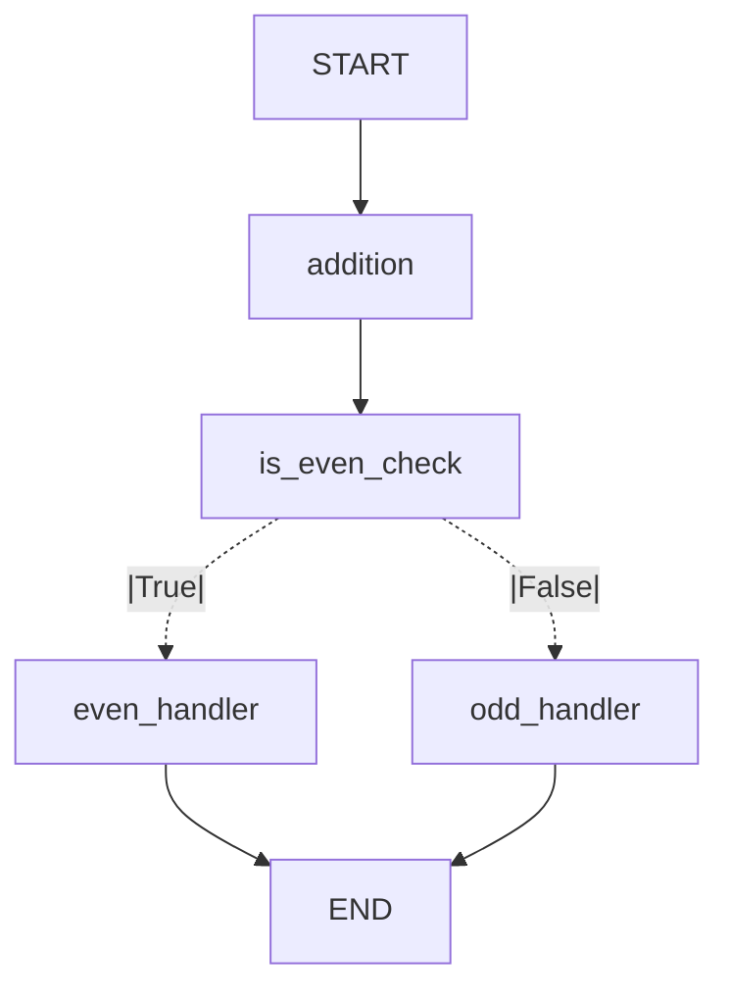

# WorkflowGraph

**WorkflowGraph** is a lightweight, self-contained TypeScript library for building and executing directed graph workflows. It's an alternative to **LangGraph** for those seeking independence from LangChain and the flexibility to implement agent workflows, while still enabling real-time streaming of results.

## Features

- **Graph-based workflows**: Build flexible, directed workflows where nodes are customizable tasks.
- **Synchronous & asynchronous support**: Define both sync and async nodes without any external dependencies.
- **Real-time streaming**: Built-in support for callbacks in each node, allowing real-time token streaming (e.g., for WebSockets).
- **LangGraph alternative**: Unlike LangGraph, WorkflowGraph provides a simpler, fully self-contained solution without needing LangChain for streaming.
- **Modular architecture**: Organized into separate modules for better maintainability and extensibility.
- **TypeScript & JavaScript support**: Written in TypeScript with full type definitions, but can be used in pure JavaScript projects.

## Installation

### From GitHub

To install directly from the GitHub repository:

```shell
npm install https://github.com/dextersjab/workflow-graph.js
```

This will download the source code and build it automatically during the installation process.

If you encounter any issues with the automatic build, you can manually build the package after installation:

```shell
cd node_modules/workflow-graph
npm install
npm run build
```

### From Git URL

You can also install via a Git URL reference:

```shell
npm install git+https://github.com/dextersjab/workflow-graph.js.git#main
```

## Using with JavaScript or TypeScript

This library is written in TypeScript but compiles to JavaScript for distribution. This means:

- **TypeScript users**: You'll get full type safety and autocompletion
- **JavaScript users**: You can use the library without any TypeScript-related configuration

### JavaScript Usage

```js
import { WorkflowGraph } from 'workflow-graph';

// Create the workflow
const graph = new WorkflowGraph();

// Add a simple node
graph.addNode('add', x => x + 1);
graph.setEntryPoint('add');
```

### TypeScript Usage

```ts
import { WorkflowGraph } from 'workflow-graph';

// With TypeScript, you can add type parameters to nodes
graph.addNode<number, number>('add', (x: number): number => x + 1);

// Execute with type safety
const result = await graph.executeAsync<number, number>(5);
```

## Basic Usage

### Implementing a Workflow

Here's how to create a simple workflow with conditional branching in **TypeScript**:

```ts
import { WorkflowGraph } from 'workflow-graph';

// Define task functions
function add(data: number, callback?: (msg: string) => void): number {
  const result = data + 1;
  if (callback) {
    callback(`Added 1: ${data} -> ${result}`);
  }
  return result;
}

function isEven(data: number): boolean {
  return data % 2 === 0;
}

function handleEven(data: number): string {
  return `Even: ${data}`;
}

function handleOdd(data: number): string {
  return `Odd: ${data}`;
}

// Create and configure the workflow graph
const graph = new WorkflowGraph();

// Add nodes
graph.addNode('addition', add);
graph.addNode('is_even_check', isEven);
graph.addNode('even_handler', handleEven);
graph.addNode('odd_handler', handleOdd);

// Define starting point
graph.setEntryPoint('addition');

// Define flow between nodes
graph.addEdge('addition', 'is_even_check');

// Add conditional branching based on is_even_check result
graph.addConditionalEdges(
  'is_even_check',
  isEven,  // path function
  { true: 'even_handler', false: 'odd_handler' }
);

// Set endpoints
graph.setFinishPoint('even_handler');
graph.setFinishPoint('odd_handler');
```

This example creates a workflow that:
1. Takes a number as input
2. Adds 1 to it
3. Checks if the result is even
4. Branches to different handlers based on the result

The corresponding **Mermaid** diagram would look like:



### Error Handling and Retries

WorkflowGraph supports built-in error handling and retry capabilities:

```ts
graph.addNode('api_call', makeApiRequest, {
  retryCount: 3,                 // Retry up to 3 times on failure
  retryDelay: 0.5,               // Wait 0.5s × attempt before retrying
  errorHandler: handleApiError    // Function called if all retries fail
});
```

## Execution Methods

Once your workflow is defined, there are two ways to execute it:

### Direct Execution (Simple)

For one-time executions, use the direct execution approach:

```ts
// Execute synchronously (internally uses async under the hood)
const result = graph.execute(inputData);

// Or execute asynchronously with a callback
const asyncResult = await graph.executeAsync(inputData, (partialMsg) => {
  console.log('Progress:', partialMsg);
});
```

### Compile-then-Execute (More Efficient for Multiple Executions)

For workflows that will be executed multiple times, compile once and reuse:

```ts
// Compile the graph
const compiledGraph = graph.compile();

async function runWorkflow(inputData: number) {
  // Execute with the compiled graph
  const result = await compiledGraph.executeAsync(inputData, (msg) => {
    console.log(`Progress update: ${msg}`);
  });
  console.log(`Final Result: ${result}`);
}

// Run the workflow with different inputs
await runWorkflow(5);
await runWorkflow(10);
```

## Generating Mermaid Diagrams

WorkflowGraph includes built-in support for generating [Mermaid.js](https://mermaid.js.org/) diagrams to visualize your workflow:

```ts
// Generate Mermaid diagram code
const mermaidCode = graph.toMermaid();
console.log(mermaidCode);
```

The generated diagram uses dashed lines (`-.->`), rather than decision nodes, to represent conditional branches. This provides a cleaner and more accurate representation of how the workflow behaves.

Mermaid diagrams can be rendered in:
- GitHub Markdown (just paste the code)
- VS Code (with the Mermaid extension)
- Web browsers (using the Mermaid Live Editor)
- Many other tools that support Mermaid

## Package Structure

The library is organized into the following modules:

- **workflow_graph**: Main package
  - **constants.ts**: Defines constants like START and END
  - **models.ts**: Defines data structures like `NodeSpec` and `Branch`
  - **builder.ts**: Contains the `WorkflowGraph` class for building graphs
  - **executor.ts**: Contains the `CompiledGraph` class for executing workflows
  - **exceptions.ts**: Contains custom exceptions for better error handling
  - **README.md**: Contains detailed documentation about the package internals

For convenience, a top-level `index.ts` file is also provided that re-exports all the public API.

> **Note**: For more technical details about the package internals, refer to the [src/workflow_graph/README.md](src/workflow_graph/README.md) file.